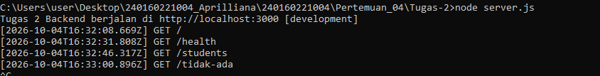
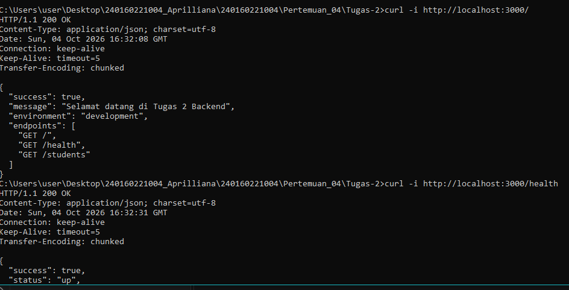
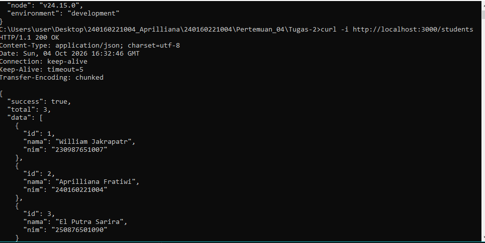
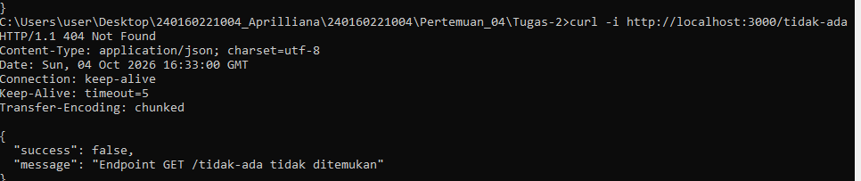

# Tugas 2 — Project Node.js dan HTTP Server Sederhana

Project Node.js tanpa Express.js menggunakan module bawaan `node:http` dengan pendekatan **ES Modules (ESM)**.

Nama    : Aprilliana Fratiwi
NPM     : 240160221004
Kelas   : SI -VB

## 📁 Struktur File

Tugas-2/
├── config.js            # Modul konfigurasi (nama aplikasi, port, environment)
├── helper.js            # Helper kirim JSON & baca file asynchronous
├── data-mahasiswa.json  # Data dummy mahasiswa
├── server.js            # HTTP Server utama
└── README.md            # Dokumentasi project

# Ketentuan Tugas & Pemenuhan
No	Ketentuan		                Implementasi
1	Module konfigurasi ESM		    config.js
2	Helper kirim JSON response		helper.js → sendJSON()
3	Minimal 3 endpoint GET		    /, /health, /students
4	Response 404		            Handler default di server.js
5	Operasi baca file async		    bacaJSON() di helper.js
6	README singkat		            File ini
7	Bukti pengujian		            Bagian Bukti Pengujian

# Cara Menjalankan
Jalankan Server :
node server.js
Server berjalan di http://localhost:3000.

# PERINTAH PENGUJIAN
a. Endpoint Root :
curl -i http://localhost:3000/

b. Endpoint Health Check :
curl -i http://localhost:3000/health

c. Endpoint Students :
curl -i http://localhost:3000/students

d. Endpoint Tidak Tersedia (404) :
curl -i http://localhost:3000/tidak-ada

# BUKTI PENGUJIAN
C:\Users\user\Desktop\240160221004_Aprilliana\240160221004\Pertemuan_04\Tugas-2>node server.js
Tugas 2 Backend berjalan di http://localhost:3000 [development]

C:\Users\user\Desktop\240160221004_Aprilliana\240160221004\Pertemuan_04\Tugas-2>curl -i http://localhost:3000/
HTTP/1.1 200 OK
Content-Type: application/json; charset=utf-8
Date: Sun, 04 Oct 2026 16:32:08 GMT
Connection: keep-alive
Keep-Alive: timeout=5
Transfer-Encoding: chunked

{
  "success": true,
  "message": "Selamat datang di Tugas 2 Backend",
  "environment": "development",
  "endpoints": [
    "GET /",
    "GET /health",
    "GET /students"
  ]
}

C:\Users\user\Desktop\240160221004_Aprilliana\240160221004\Pertemuan_04\Tugas-2>curl -i http://localhost:3000/health
HTTP/1.1 200 OK
Content-Type: application/json; charset=utf-8
Date: Sun, 04 Oct 2026 16:32:31 GMT
Connection: keep-alive
Keep-Alive: timeout=5
Transfer-Encoding: chunked

{
  "success": true,
  "status": "up",
  "node": "v24.15.0",
  "environment": "development"
}

C:\Users\user\Desktop\240160221004_Aprilliana\240160221004\Pertemuan_04\Tugas-2>curl -i http://localhost:3000/students
HTTP/1.1 200 OK
Content-Type: application/json; charset=utf-8
Date: Sun, 04 Oct 2026 16:32:46 GMT
Connection: keep-alive
Keep-Alive: timeout=5
Transfer-Encoding: chunked

{
  "success": true,
  "total": 3,
  "data": [
    {
      "id": 1,
      "nama": "William Jakrapatr",
      "nim": "230987651007"
    },
    {
      "id": 2,
      "nama": "Aprilliana Fratiwi",
      "nim": "240160221004"
    },
    {
      "id": 3,
      "nama": "El Putra Sarira",
      "nim": "250876501090"
    }
  ]
}

C:\Users\user\Desktop\240160221004_Aprilliana\240160221004\Pertemuan_04\Tugas-2>curl -i http://localhost:3000/tidak-ada
HTTP/1.1 404 Not Found
Content-Type: application/json; charset=utf-8
Date: Sun, 04 Oct 2026 16:33:00 GMT
Connection: keep-alive
Keep-Alive: timeout=5
Transfer-Encoding: chunked

{
  "success": false,
  "message": "Endpoint GET /tidak-ada tidak ditemukan"
}

C:\Users\user\Desktop\240160221004_Aprilliana\240160221004\Pertemuan_04\Tugas-2>node server.js
Tugas 2 Backend berjalan di http://localhost:3000 [development]
[2026-10-04T16:32:08.669Z] GET /
[2026-10-04T16:32:31.808Z] GET /health
[2026-10-04T16:32:46.317Z] GET /students
[2026-10-04T16:33:00.896Z] GET /tidak-ada

