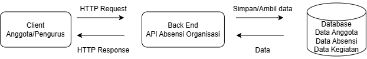

#Tugas 1 - Analisis & Desain API

*Nama:* Rahma Nadya
*NIM:* 240160221035

## 1. Deskripsi Sistem
Sistem Informasi Absensi Organisasi digunakan oleh anggota dan pengurus organisasi untuk mengelola data kehadiran anggota. Sistem ini memiliki fitur untuk mencatat kehadiran, melihat data absensi, serta mengelola data anggota dan kegiatan organisasi. Pengurus dapat mengelola data anggota dan absensi, sedangkan anggota dapat melakukan absensi dan melihat riwayat kehadirannya.

## 2. Diagram

Diagram arsitektur Sistem Informasi Absensi Organisasi:

2. Tabel Resource & Endpoint
| Operasi | Method | Endpoint | Request Body | Response Body | Status Code |
|---|---|---|---|---|---|
| Melihat semua anggota | GET | `/anggota` | - | Data seluruh anggota | 200 / 500 |
| Melihat anggota berdasarkan ID | GET | `/anggota/:id` | - | Data anggota | 200 / 404 |
| Menambah anggota | POST | `/anggota` | nama, nim | Data anggota baru | 201 / 400 |
| Mengubah data anggota | PUT | `/anggota/:id` | nama, nim | Data anggota yang diperbarui | 200 / 404 |
| Melihat semua absensi | GET | `/absensi` | - | Data seluruh absensi | 200 / 500 |
| Melihat absensi berdasarkan ID | GET | `/absensi/:id` | - | Data absensi | 200 / 404 |
| Menambah absensi | POST | `/absensi` | anggota_id, kegiatan_id, status | Data absensi baru | 201 / 400 |
| Menghapus absensi | DELETE | `/absensi/:id` | - | Data absensi yang dihapus | 200 / 404 |

3. Contoh JSON
Resource Anggota

Request Body:

{
  "nama": "Rahma Nadya",
  "nim": "240160221035"
}

Response Body:

{
  "success": true,
  "message": "Anggota berhasil ditambahkan",
  "data": {
    "id": 1,
    "nama": "Rahma Nadya",
    "nim": "240160221035"
  }
}

Resource Absensi

Request Body:

{
  "anggota_id": 1,
  "kegiatan_id": 1,
  "status": "Hadir"
}

Response Body:

{
  "success": true,
  "message": "Absensi berhasil dicatat",
  "data": {
    "id": 1,
    "anggota_id": 1,
    "kegiatan_id": 1,
    "status": "Hadir"
  }
}

   5. Skenario 1 — Menampilkan seluruh anggota

Request:

GET /anggota

Response:

{
  "success": true,
  "data": [
    {
      "id": 1,
      "nama": "Rahma Nadya",
      "nim": "240160221035"
    }
  ]
}

Status Code: 200 OK

Skenario 2 — Menambahkan absensi

Request:

POST /absensi

Request Body:

{
  "anggota_id": 1,
  "kegiatan_id": 1,
  "status": "Hadir"
}

Response:

{
  "success": true,
  "message": "Absensi berhasil dicatat",
  "data": {
    "id": 1,
    "anggota_id": 1,
    "kegiatan_id": 1,
    "status": "Hadir"
  }
}

Status Code: 201 Created

Skenario 3 — Data anggota tidak ditemukan 

Request:

GET /anggota/99

Response:

{
  "success": false,
  "message": "Anggota tidak ditemukan"
}

Status Code: 404 Not Found